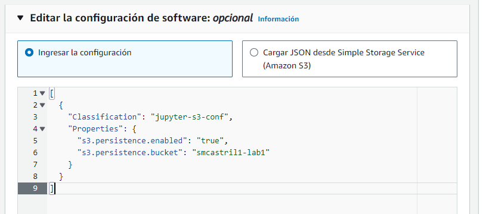

# ST0263 Temas especiales en telemática
#
# Sara María Castrillón Ríos - smcastril1@eafit.edu.co
#
# Edwin Nelson Montoya Múnera - emontoya@eafit.edu.co
#

# Laboratorio0 - Instalar un clúster EMR versión 6.14.0 Hadoop/Spark:
#

## Paso a Paso:

1. Crea un cluster de Hadoop con las siguientes aplicaciones:
   

   **Nota: seleccionar los catalogos Hive y Spark permite ver las tablas AWS Glue en EMR, y las
tablas Hive se podrán ver en Glue / Athena.**
  

2. Configurar el software settings de la siguiete manera:
   
  Nota: En el campo "s3.persistence.bucket": "smcastril1-lab1". "smcastrill1-lab1" Debe ser el nombre de un bucket creado     con anterioridad en s3.

3. Agregue los las configuraciones de seguridad y los roles de esa manera:
  Service role: EMR_DefaultRole
  Instance profile: EMR_EC2_DefaultRole
  Custom automatic scaling role: LabRole

  
Se cumplió la funcionalidad de Apigateway, con ayuda de un API_Rest de flask, la cual toma las peticiones y las tranforma de JSON, que es el standar de la red a mensajes que puedan ser enviados por gRPC o AMQP a través de protobuffers. 
Se cumplió la funcionalidad tanto de buscar archivos como la de listarlos, la fucionalidad del primer microservicio conectado a traves de gRPC y se construyó correctamente la interfaz en donde se despliega en aws con una IP elastica.
Se cumplió la funcionalidad de toleracia a fallos en donde se responde a las peticiones de manera asincrónica con ayuda de rabbitMQ y que se haga pulling al MOM de la solicitud encolada.

## 1.2. Que aspectos NO cumplió o desarrolló de la actividad propuesta por el profesor (requerimientos funcionales y no funcionales)
No se cumplió que el microservicio 2 devuelva la respuesta a las peticiones entrantes, pues a pesar de que es capaz de devolver mensajes, tiene problemas a la hora de enviar la respuesta esperada.

# 2. información general de diseño de alto nivel, arquitectura, patrones, mejores prácticas utilizadas.
- La arquitectura es basada en microservicios los cuales se comunican entre si mediante grpc y colas.
- En la comunicacion por grpc se utilizan callbacks para atrapar posibles errores.
- En la comunicacion por colas se utilizan funciones asincrónas

Descripción del tiempo de vida de la solicitud:


Inicialmente un cliente Postman se conecta a el procutor API_Gateway de mensajes, enviandole la solicitud desead listar, o encontrar archivos.  El API_Gateway se encarga de generar un mensaje claro para lo microservicios y este es enviado a uno de ellos
donde se generará respuesta y se enviará nuevamente al cliente. En condiciones igeales nuestra opción 1 será el srv_1 el cual funciona a través de gRPC y devolverá la solicitud inmediatmente. En caso de que esté servidor halla fallado se enviará la solicitud al ser_2, el cual está atendiendo a través de colas, se ha creado una cola para las request, que es donde el MOM irá en bsca de ellas para procesarlas y luego depositarlas en una segunda cola de responses en donde el API_Gateway podrá generar pulls con ayuda de un ID para saber si su request ha sido procesada.

# 3. Descripción del ambiente de desarrollo y técnico: lenguaje de programación, librerias, paquetes, etc.
La principal tecnologia usada fue python, para el API REST se creo una API con flask, y para la comunicacion con los microservicios se usó gRPC y Rabbitmq. 
Se utilizó docker para lanzar el el servidor de rabbitMQ y Makefile para facilitar la compilación.
Además de los archivos .proto para generar los contrados de mesajería IDL.

## como se compila y ejecuta.
Hay que tener en cuenta que se tienen 4 máquinas remotas.

La primera máquina a configurar es la de MOM con dirección IP elastica: 54.85.196.208
Se verificar que esta corriendo rabbitmq en la imagen de docker, si no esta corriendo inicializar:
```
docker start rabbit-server
```
Una vez inicializado el rabbitMO podemos ingresar desde el navegador a http://54.85.196.208:15672/ para acceder, vizualizar y modificar uestras colas y exchanges. El usuario y contraseña por defecto son "user" y "password".


Una vez hemos subido el rabbit-server, debemos empezar a correr los microservicios. Es indispensable que estos se corran primero, pues serán los que se podrán a esperar por peticiones.

Para correr el microservicio 1  con IP elastica: 3.209.30.241 nos ubicamos en la carpeta donde este se encuentra.
```
cd smcastril1-st0263/Reto2/Solucion-DEFINITIVO/srv_1
```
Una vez estamos el la carpeta, debemos compilar e instalar las dependencias necesarias, para lo cual se creó un Makefile que hará la tarea por usted.
```
make srv_1
```

Finalemente corremos el ejecutable del microservicio 1.
```
python3 consumer_grpc.py
```
A continuación se pondrá a correr el microservicio 2 con IP elástica: 35.173.12.205, los pasos a seguir son muy similares:

Para correr el microservicio 2 nos ubicamos en la carpeta donde este se encuentra.
```
cd smcastril1-st0263/Reto2/Solucion-DEFINITIVO/srv_2
```
Una vez estamos el la carpeta, debemos compilar e instalar las dependencias necesarias, para lo cual se creó un Makefile que hará la tarea por usted.
```
make srv_2
```
Finalemente corremos el ejecutable del microservicio 1.
```
python3 consumer_rabbitMQ.py
```
Una vez estan corriendo nuestros microservicios, podemos conectarnos a ellos a través de un productor gRPC:

Para correr el APE_Gateway con IP elástica: 3.222.15.155 nos ubicamos en la carpeta donde este se encuentra.
```
cd smcastril1-st0263/Reto2/Solucion-DEFINITIVO/API_Gateway
```
Una vez estamos el la carpeta, debemos compilar e instalar las dependencias necesarias, para lo cual se creó un Makefile que hará la tarea por usted.
```
make API_Gateway
```
Finalemente corremos el ejecutable.
```
sudo python3 producer_REST.py
```
Finalmente, cuando ya nuestro producer está corriendo, podemos conectarnos a el a travez de API REST, desde Postman, teniendo en cuenta que  La API de flask corre en el puerto 80, y escucha desde cualquier parte. 


Debemos conectarnos desde el Postman hacia la dirección IP elastica del API_Gateway (3.222.15.155) de esta manera:


# Referencias:

https://www.geeksforgeeks.org/what-is-message-oriented-middleware-mom/
https://flask.palletsprojects.com/en/2.3.x/
https://www.rabbitmq.com/getstarted.html

# Funcionality Demo:

A continuación se presenta un video que explica como funciona el proyecto:

https://eafit-my.sharepoint.com/personal/smcastril1_eafit_edu_co/_layouts/15/stream.aspx?id=%2Fpersonal%2Fsmcastril1%5Feafit%5Fedu%5Fco%2FDocuments%2FGrabaciones%2FRoom%2018%2D20230830%5F233441%2DMeeting%20Recording%2Emp4&ga=1

