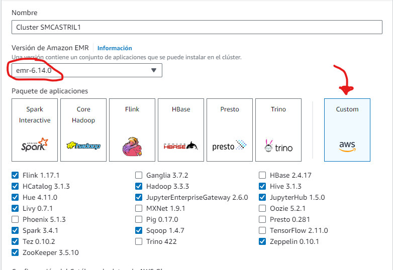
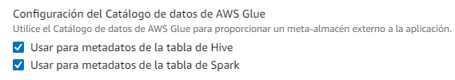
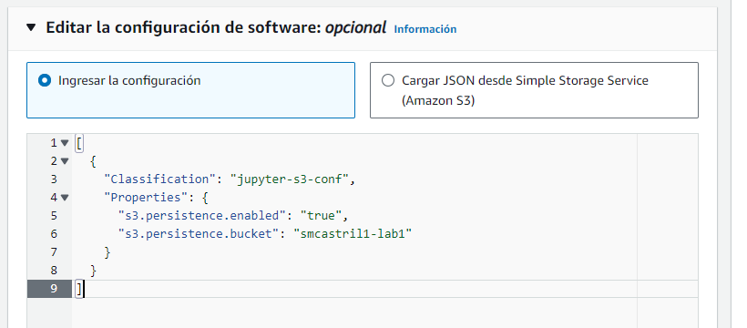
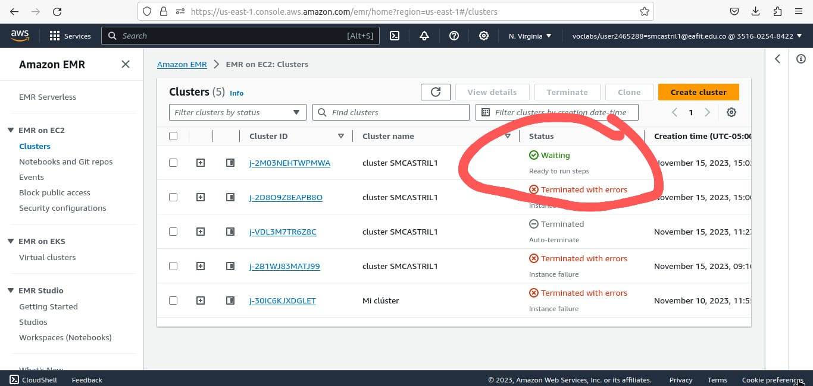
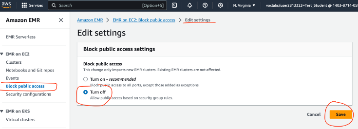
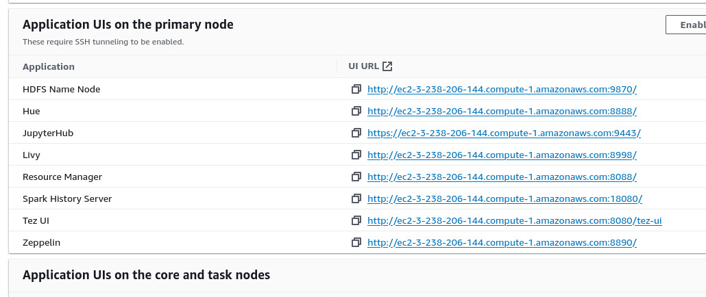

# ST0263 Temas especiales en telemática
#
# Sara María Castrillón Ríos - smcastril1@eafit.edu.co
#
# Edwin Nelson Montoya Múnera - emontoya@eafit.edu.co
#

# Laboratorio0 - Instalar un clúster EMR versión 6.14.0 Hadoop/Spark:
#

## Paso a Paso:

1. Crea un cluster de Hadoop con las siguientes aplicaciones:
   

   **Nota: seleccionar los catalogos Hive y Spark permite ver las tablas AWS Glue en EMR, y las
tablas Hive se podrán ver en Glue / Athena.**
  

2. Configurar el software settings de la siguiete manera:
   


  Nota: En el campo "s3.persistence.bucket": "smcastril1-lab1". "smcastrill1-lab1" Debe ser el nombre de un bucket creado     con anterioridad en s3.

3. Agregue los las configuraciones de seguridad y los roles de esa manera:
  - Service role: EMR_DefaultRole
  - Instance profile: EMR_EC2_DefaultRole
  - Custom automatic scaling role: LabRole

4. Deja las demás configuraciones por defcto y finalmente click en "crear cluster".

La creación de el clúster demorará aproximadamente 20 minutos. Sabrá que se creó exitosamente, cuando vea el estado en "waiting".



5. Debe abrir todos los puertos TCP para acceso al clúster así:


6. También  debe  abrir los  puertos  de  las  aplicaciones  de  hadoop/Spark  en  el  Security  Group  del  nodo MASTER del cluster (entrando al servicio EC2 de dicha máquina Master).
Los puestos a abrir los verá en la parte de aplicaciones de su clúster:



Además, abrir los puertosTCP:
- 22
- 14000
- 987


  
Se cumplió la funcionalidad de Apigateway, con ayuda de un API_Rest de flask, la cual toma las peticiones y las tranforma de JSON, que es el standar de la red a mensajes que puedan ser enviados por gRPC o AMQP a través de protobuffers. 
Se cumplió la funcionalidad tanto de buscar archivos como la de listarlos, la fucionalidad del primer microservicio conectado a traves de gRPC y se construyó correctamente la interfaz en donde se despliega en aws con una IP elastica.
Se cumplió la funcionalidad de toleracia a fallos en donde se responde a las peticiones de manera asincrónica con ayuda de rabbitMQ y que se haga pulling al MOM de la solicitud encolada.

## 1.2. Que aspectos NO cumplió o desarrolló de la actividad propuesta por el profesor (requerimientos funcionales y no funcionales)
No se cumplió que el microservicio 2 devuelva la respuesta a las peticiones entrantes, pues a pesar de que es capaz de devolver mensajes, tiene problemas a la hora de enviar la respuesta esperada.

# 2. información general de diseño de alto nivel, arquitectura, patrones, mejores prácticas utilizadas.
- La arquitectura es basada en microservicios los cuales se comunican entre si mediante grpc y colas.
- En la comunicacion por grpc se utilizan callbacks para atrapar posibles errores.
- En la comunicacion por colas se utilizan funciones asincrónas

Descripción del tiempo de vida de la solicitud:


Inicialmente un cliente Postman se conecta a el procutor API_Gateway de mensajes, enviandole la solicitud desead listar, o encontrar archivos.  El API_Gateway se encarga de generar un mensaje claro para lo microservicios y este es enviado a uno de ellos
donde se generará respuesta y se enviará nuevamente al cliente. En condiciones igeales nuestra opción 1 será el srv_1 el cual funciona a través de gRPC y devolverá la solicitud inmediatmente. En caso de que esté servidor halla fallado se enviará la solicitud al ser_2, el cual está atendiendo a través de colas, se ha creado una cola para las request, que es donde el MOM irá en bsca de ellas para procesarlas y luego depositarlas en una segunda cola de responses en donde el API_Gateway podrá generar pulls con ayuda de un ID para saber si su request ha sido procesada.

# 3. Descripción del ambiente de desarrollo y técnico: lenguaje de programación, librerias, paquetes, etc.
La principal tecnologia usada fue python, para el API REST se creo una API con flask, y para la comunicacion con los microservicios se usó gRPC y Rabbitmq. 
Se utilizó docker para lanzar el el servidor de rabbitMQ y Makefile para facilitar la compilación.
Además de los archivos .proto para generar los contrados de mesajería IDL.

## como se compila y ejecuta.
Hay que tener en cuenta que se tienen 4 máquinas remotas.

La primera máquina a configurar es la de MOM con dirección IP elastica: 54.85.196.208
Se verificar que esta corriendo rabbitmq en la imagen de docker, si no esta corriendo inicializar:
```
docker start rabbit-server
```
Una vez inicializado el rabbitMO podemos ingresar desde el navegador a http://54.85.196.208:15672/ para acceder, vizualizar y modificar uestras colas y exchanges. El usuario y contraseña por defecto son "user" y "password".


Una vez hemos subido el rabbit-server, debemos empezar a correr los microservicios. Es indispensable que estos se corran primero, pues serán los que se podrán a esperar por peticiones.

Para correr el microservicio 1  con IP elastica: 3.209.30.241 nos ubicamos en la carpeta donde este se encuentra.
```
cd smcastril1-st0263/Reto2/Solucion-DEFINITIVO/srv_1
```
Una vez estamos el la carpeta, debemos compilar e instalar las dependencias necesarias, para lo cual se creó un Makefile que hará la tarea por usted.
```
make srv_1
```

Finalemente corremos el ejecutable del microservicio 1.
```
python3 consumer_grpc.py
```
A continuación se pondrá a correr el microservicio 2 con IP elástica: 35.173.12.205, los pasos a seguir son muy similares:

Para correr el microservicio 2 nos ubicamos en la carpeta donde este se encuentra.
```
cd smcastril1-st0263/Reto2/Solucion-DEFINITIVO/srv_2
```
Una vez estamos el la carpeta, debemos compilar e instalar las dependencias necesarias, para lo cual se creó un Makefile que hará la tarea por usted.
```
make srv_2
```
Finalemente corremos el ejecutable del microservicio 1.
```
python3 consumer_rabbitMQ.py
```
Una vez estan corriendo nuestros microservicios, podemos conectarnos a ellos a través de un productor gRPC:

Para correr el APE_Gateway con IP elástica: 3.222.15.155 nos ubicamos en la carpeta donde este se encuentra.
```
cd smcastril1-st0263/Reto2/Solucion-DEFINITIVO/API_Gateway
```
Una vez estamos el la carpeta, debemos compilar e instalar las dependencias necesarias, para lo cual se creó un Makefile que hará la tarea por usted.
```
make API_Gateway
```
Finalemente corremos el ejecutable.
```
sudo python3 producer_REST.py
```
Finalmente, cuando ya nuestro producer está corriendo, podemos conectarnos a el a travez de API REST, desde Postman, teniendo en cuenta que  La API de flask corre en el puerto 80, y escucha desde cualquier parte. 


Debemos conectarnos desde el Postman hacia la dirección IP elastica del API_Gateway (3.222.15.155) de esta manera:


# Referencias:

https://www.geeksforgeeks.org/what-is-message-oriented-middleware-mom/
https://flask.palletsprojects.com/en/2.3.x/
https://www.rabbitmq.com/getstarted.html

# Funcionality Demo:

A continuación se presenta un video que explica como funciona el proyecto:

https://eafit-my.sharepoint.com/personal/smcastril1_eafit_edu_co/_layouts/15/stream.aspx?id=%2Fpersonal%2Fsmcastril1%5Feafit%5Fedu%5Fco%2FDocuments%2FGrabaciones%2FRoom%2018%2D20230830%5F233441%2DMeeting%20Recording%2Emp4&ga=1

