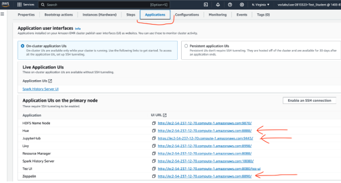
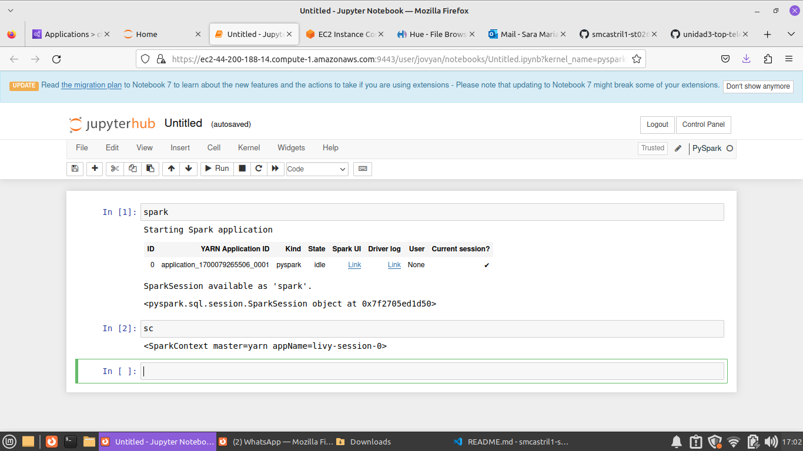

## ST0263 Temas especiales en telemática
#
## Sara María Castrillón Ríos - smcastril1@eafit.edu.co
#
## Edwin Nelson Montoya Múnera - emontoya@eafit.edu.co
#

## Laboratorio0 - Instalar un clúster EMR versión 6.14.0 Hadoop/Spark:
#

## Paso a Paso:

1. Crea un cluster de Hadoop con las siguientes aplicaciones:
   

   **Nota: seleccionar los catalogos Hive y Spark permite ver las tablas AWS Glue en EMR, y las
tablas Hive se podrán ver en Glue / Athena.**
  

2. Configurar el software settings de la siguiete manera:
   


  Nota: En el campo "s3.persistence.bucket": "smcastril1-lab1". "smcastrill1-lab1" Debe ser el nombre de un bucket creado     con anterioridad en s3.

3. Agregue los las configuraciones de seguridad y los roles de esa manera:
  - Service role: EMR_DefaultRole
  - Instance profile: EMR_EC2_DefaultRole
  - Custom automatic scaling role: LabRole

4. Deja las demás configuraciones por defcto y finalmente click en "crear cluster".

La creación de el clúster demorará aproximadamente 20 minutos. Sabrá que se creó exitosamente, cuando vea el estado en "waiting".


5. Debe abrir todos los puertos TCP para acceso al clúster así:


6. También  debe  abrir los  puertos  de  las  aplicaciones  de  hadoop/Spark  en  el  Security  Group  del  nodo MASTER del cluster (entrando al servicio EC2 de dicha máquina Master).
Los puestos a abrir los verá en la parte de aplicaciones de su clúster:


Además, abrir los puertosTCP:
- 22
- 14000
- 987


## Resultados:

Una vez creado el clúster, debe ser capaz de:
- Ingrasar al cluater ERM a través de Hue.
- Entrar a la aplicación de JupyterHub

## Ingrasar al cluater ERM a través de Hue:

1. Dirijase a la sección de aplicaciones y haga click en la URL de Hue.


2. Ingrese el usuario (siempre será hadoop) y la contraseña de su preferencia.

3. A continuación verá una interfaz como esta:


Donde podrá acceder los servicios Hive, Spark, S3, pero el servicio de Files (archivos) HDFS falla, y le saldrá un error así:


4. Para solucionar el error:
- Entrar al EC2 nodo master por SSH:
  
- Editar el archivo hue.ini con el siguiente comando:
  ```nano /etc/hue/conf/hue.ini```
- Buscar la línea que contenga: ‘webhdfs-url’ y cambiar el puerto de 14000 a 9870


5. Guardar los cambios con  control-x-> Y

6. Reiniciar el servicio hue:

 ``` systemctl restart hue.service  ```

 ¡FELICIDADES! Ahora puede gestionar archivos sin problema por hue para HDFS.
 


 ## Entrar a la aplicación de JupyterHub:

 1. Dirijase a la sección de aplicaciones y haga click en la URL de jupyterHub.


2. Utilice el usuario por defecto:
Username: jovyan
Password:jupyter


¡FELICITACIONES!,  ahora  puede  realizar  notebooks  pyspark.No olvide verificar  que  las  2  variables  más  importantes  de contexto de spark estan activas en un notebook así:(primero debe crear un notebook pyspark)


