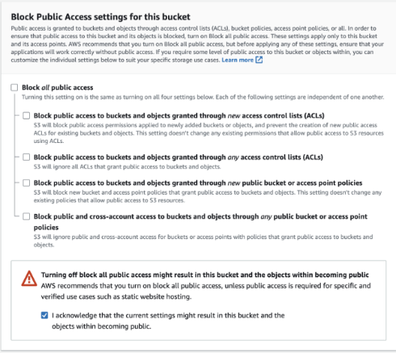
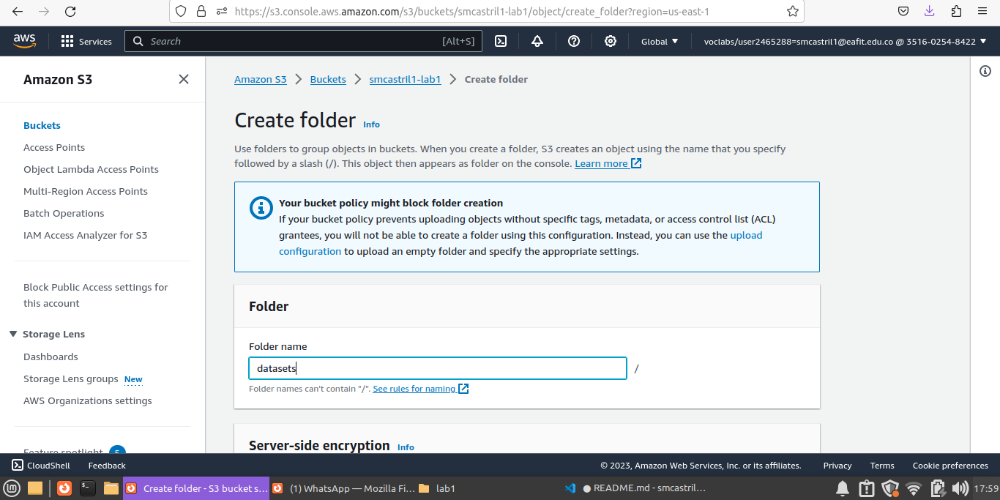
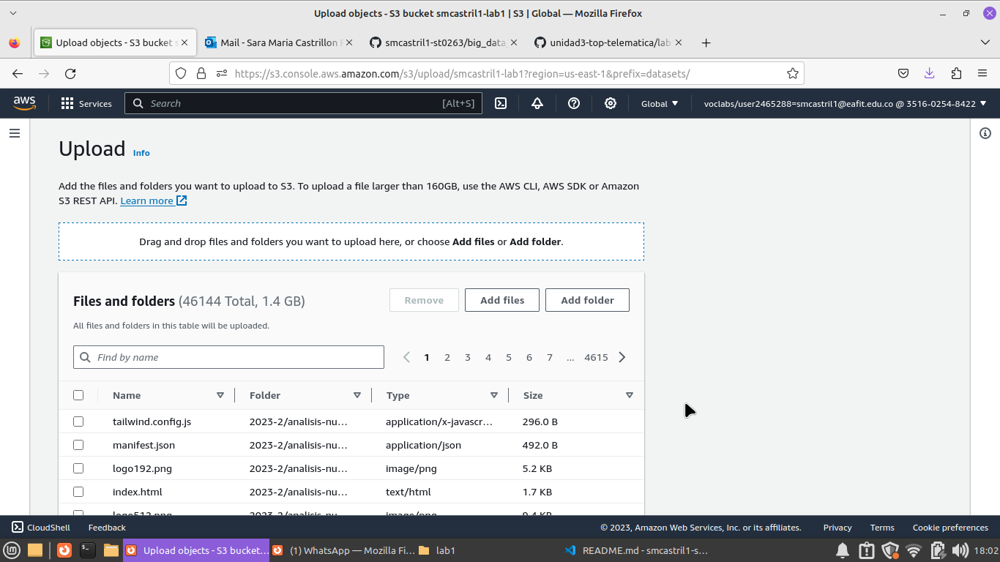
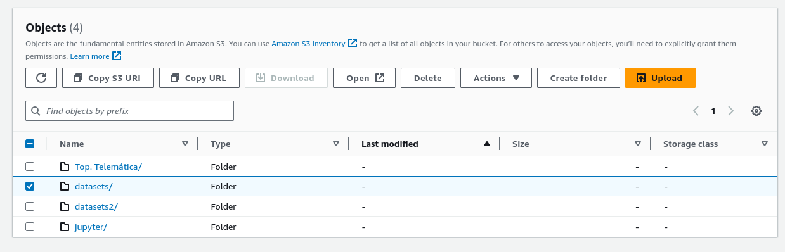

## ST0263 Temas especiales en telemática

#

## Sara María Castrillón Ríos - smcastril1@eafit.edu.co

#

## Edwin Nelson Montoya Múnera - emontoya@eafit.edu.co

#

## Laboratorio1 - HDFS:

#

## Paso a Paso:

# Primer paso - Crear el bucket:

1. Buscar el servicio S3 en el cuadro de búsqueda de servicios AWS.
2. Crear un bucket. Con los sigientes parametros:

- AWS Region: us-east-1
- Deshabilitar ‘Configuración de bloqueo de acceso público para este bucket. Debe verse asi:
  

3. Así se verá el bucket creado:
   

# Segundo paso - Copiar los archivos al bucket:

1. Haga click al bucket creado y cree un nuevo directorio manualmente.
   

2. Suba los archivos a su nuevo dataset, dando click en upload.
   

3. Espere a que se carguen los archivos que acaba de subir y hagalos públicos.

4. De click en "Copy S3 URL":

`s3://smcastril1-lab1/datasets/ `

`s3://smcastril1-lab1/datasets2/ `
