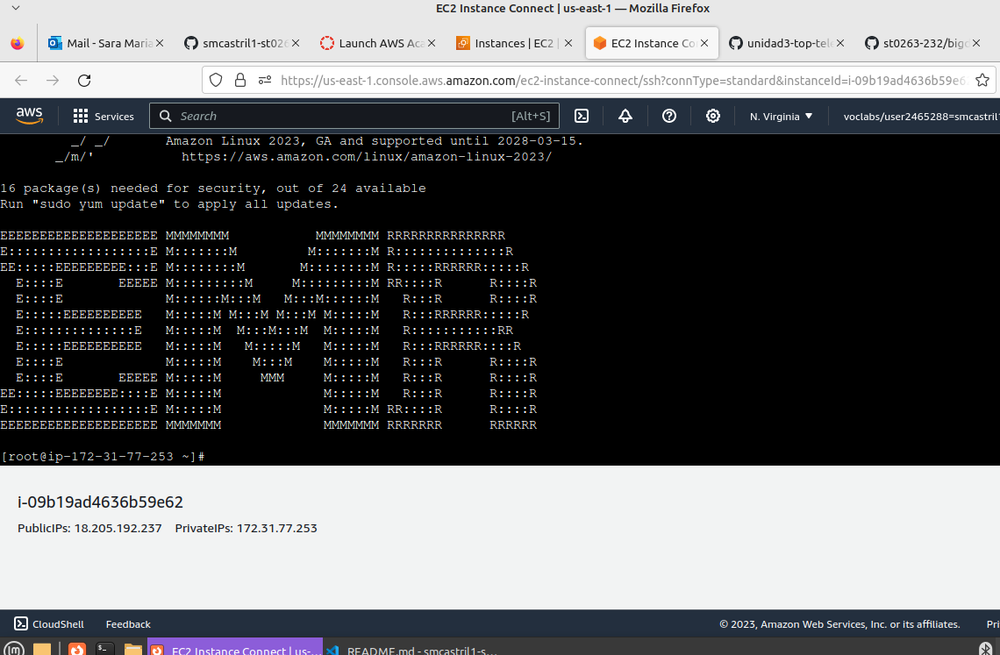
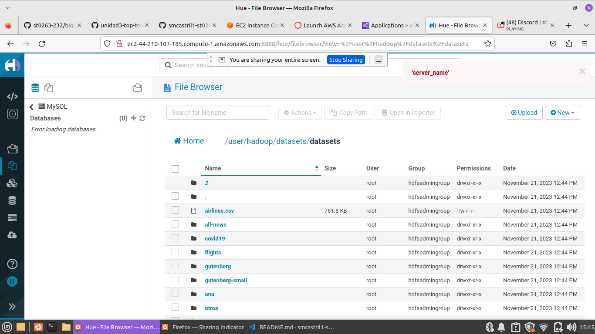

## ST0263 Temas especiales en telemática

#

## Sara María Castrillón Ríos - smcastril1@eafit.edu.co

#

## Edwin Nelson Montoya Múnera - emontoya@eafit.edu.co

#

## Laboratorio1 - HDFS:

#

## Paso a Paso:

# Primer paso - Crear el bucket:

1. Buscar el servicio S3 en el cuadro de búsqueda de servicios AWS.
2. Crear un bucket. Con los sigientes parametros:

- AWS Region: us-east-1
- Deshabilitar ‘Configuración de bloqueo de acceso público para este bucket. Debe verse asi:
  

3. Así se verá el bucket creado:
   

# Segundo paso - Copiar los archivos al bucket:

1. Haga click al bucket creado y cree un nuevo directorio manualmente.
   

2. Suba los archivos a su nuevo dataset, dando click en upload.
   

3. Espere a que se carguen los archivos que acaba de subir y hagalos públicos.

4. De click en "Copy S3 URL":


`s3://smcastril1-lab1/datasets/ `

`s3://smcastril1-lab1/datasets2/ `

# Tercer paso - CONECTARSE AL CLUSTER AMAZON EMR:



# Cuarto paso - GESTIÓN DE ARCHIVOS EN HDFS VÍA TERMINAL:

1. Instale git:

```
sudo yum update
```

```
sudo yum install git
```

2. Clone el repositorio:

```
git clone https://github.com/st0263eafit/st0263-232.git
```

3. Crear tu propio directorio de 'datasets' en HDFS:

```
hdfs dfs -mkdir /user/hadoop/datasets
```

4. Copiar archivos locales (al servidor gateway) hacia HDFS:

```
 hdfs dfs -copyFromLocal st0263-232/bigdata/datasets/* /user/hadoop/datasets
```


