## ST0263 Temas especiales en telemática

#

## Sara María Castrillón Ríos - smcastril1@eafit.edu.co

#

## Edwin Nelson Montoya Múnera - emontoya@eafit.edu.co

#

## Laboratorio2 - Spark:

#

1. Via pyspark en el nodo master:
   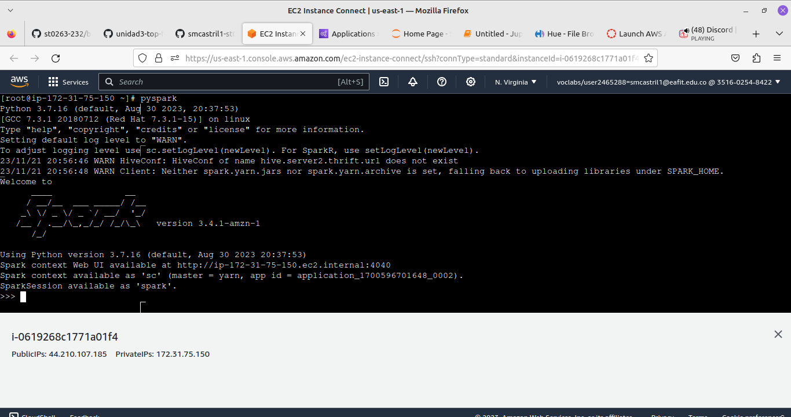

2. Correrlo como un archivo python:

```
spark-submit --master yarn --deploy-mode cluster wc-pyspark.py
```

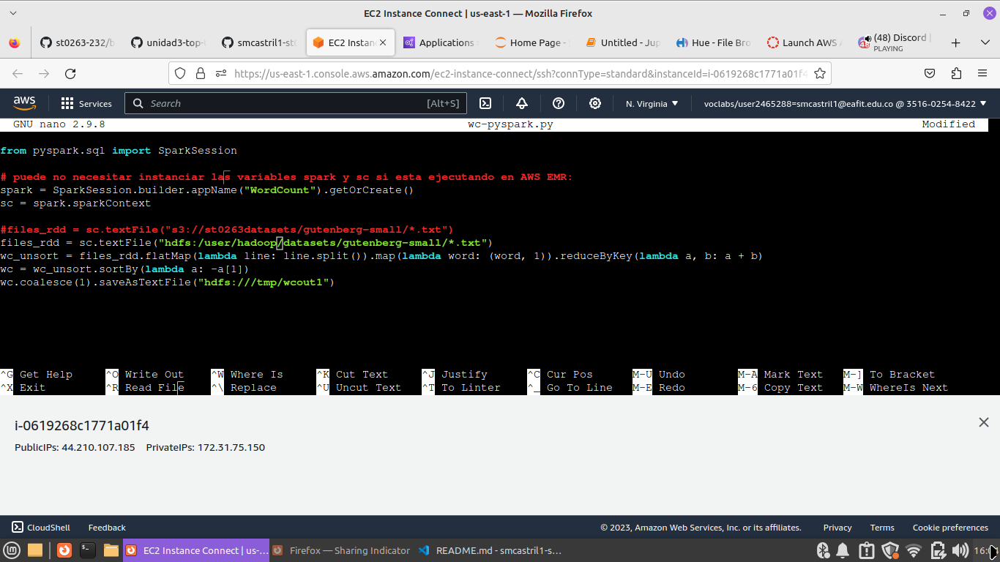
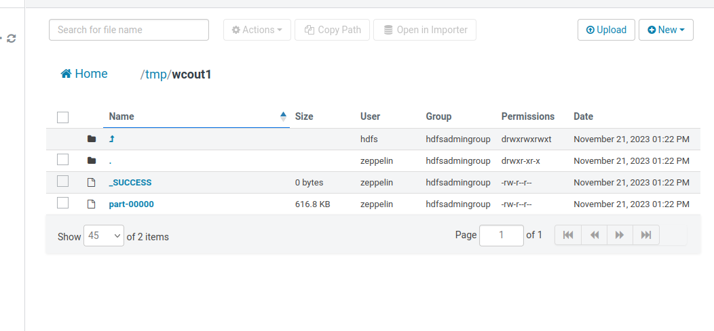

3. Correrlo desde un Zeppelin notebook:

3.1 Cree un notebook:
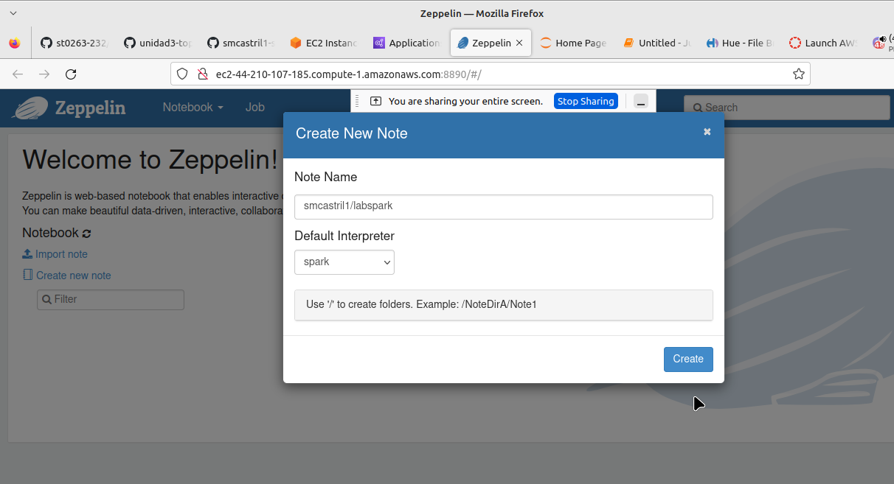

3.2 Wordcount en python:

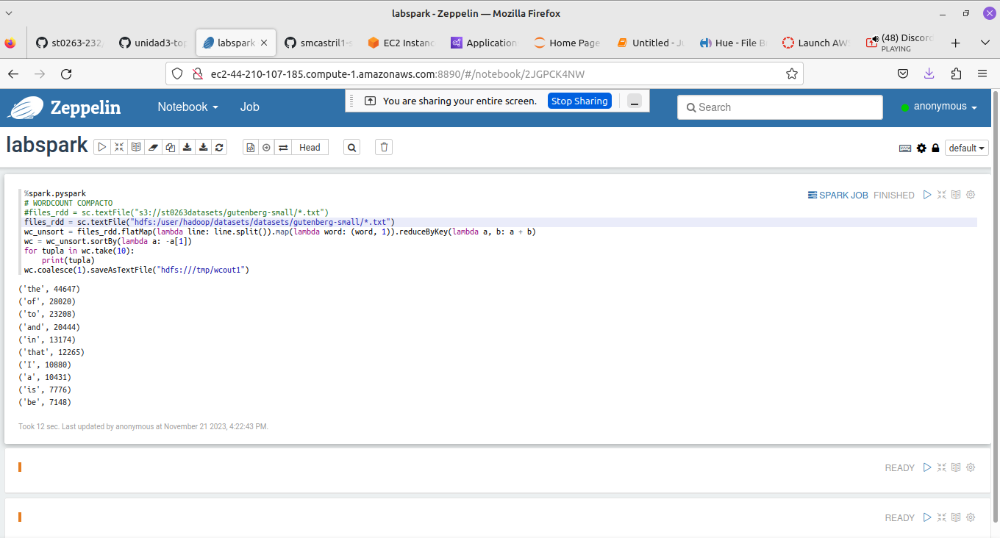

```
%spark.pyspark
# WORDCOUNT COMPACTO
#files_rdd = sc.textFile("s3://st0263datasets/gutenberg-small/*.txt")
files_rdd = sc.textFile("hdfs:///datasets/gutenberg-small/*.txt")
wc_unsort = files_rdd.flatMap(lambda line: line.split()).map(lambda word: (word, 1)).reduceByKey(lambda a, b: a + b)
wc = wc_unsort.sortBy(lambda a: -a[1])
for tupla in wc.take(10):
    print(tupla)
    wc.coalesce(1).saveAsTextFile("hdfs:///tmp/wcout1")
```


4. Jupyter Notebooks en EMR:
   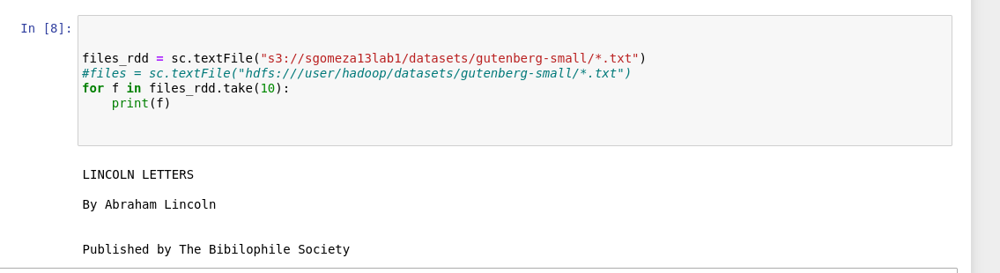
   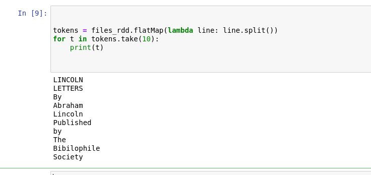
   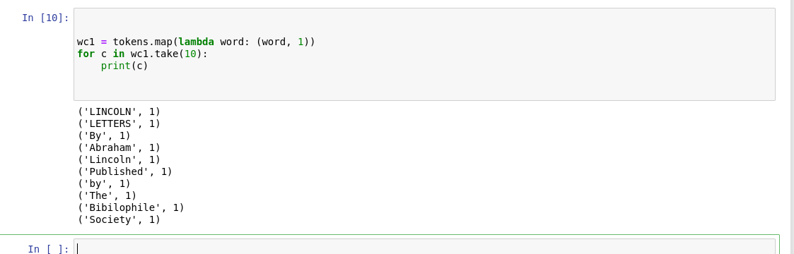
   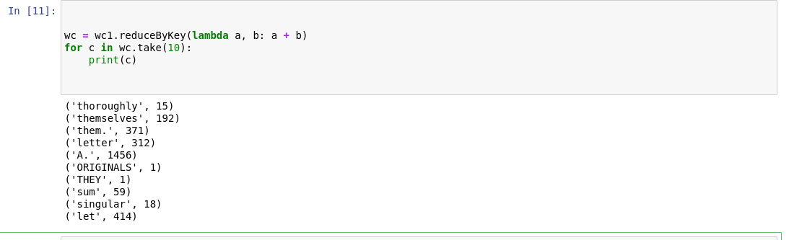
   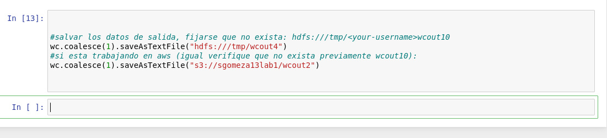
   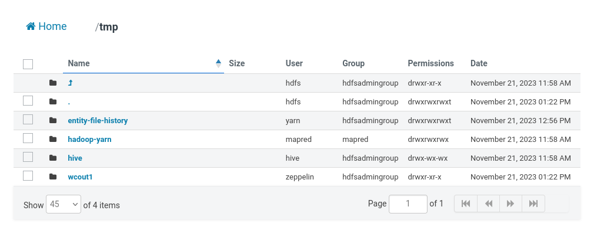
