# Laboratorio 3

#

# Primer paso: Creacion de la base de datos:

1. Desde Athena:
   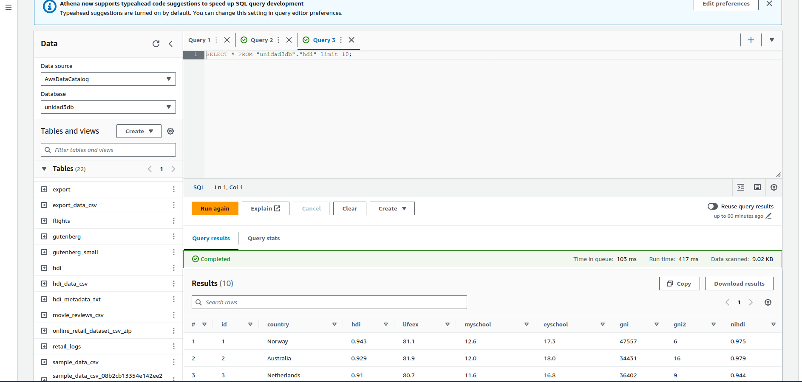
2. Desde Hive:
   - 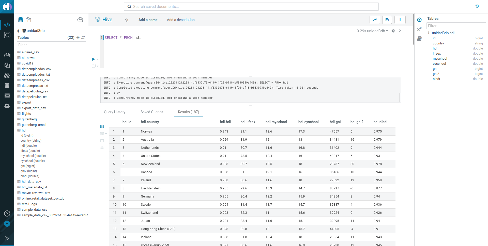
   - 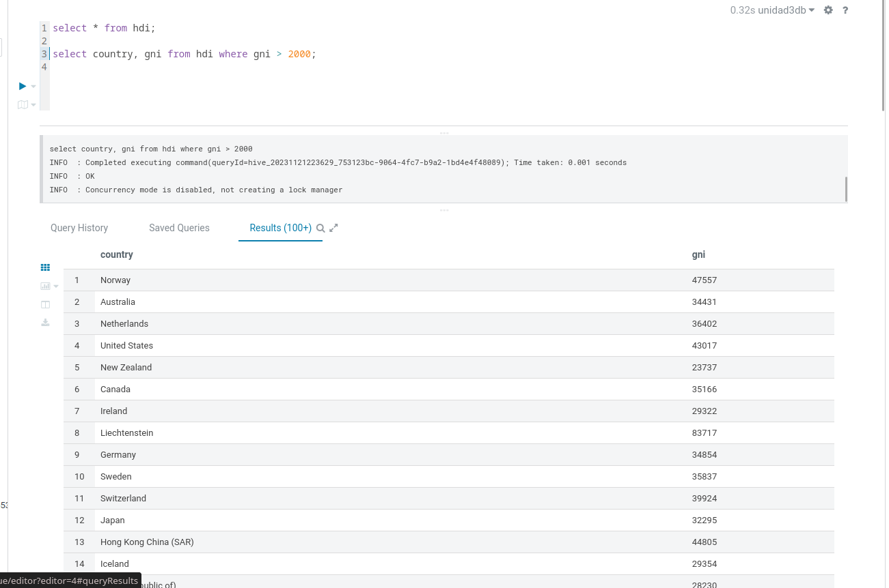
   - 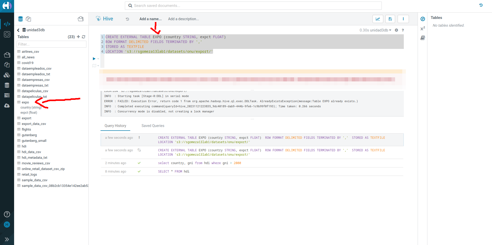
   - 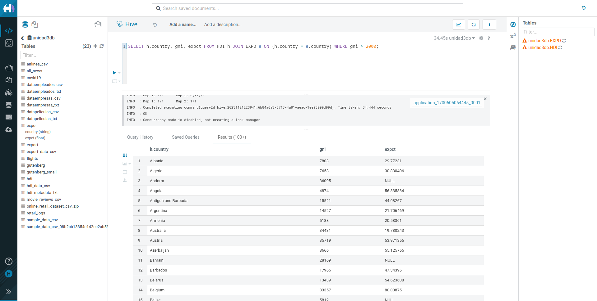

# Segundo paso: Wordcount en Hive

1.  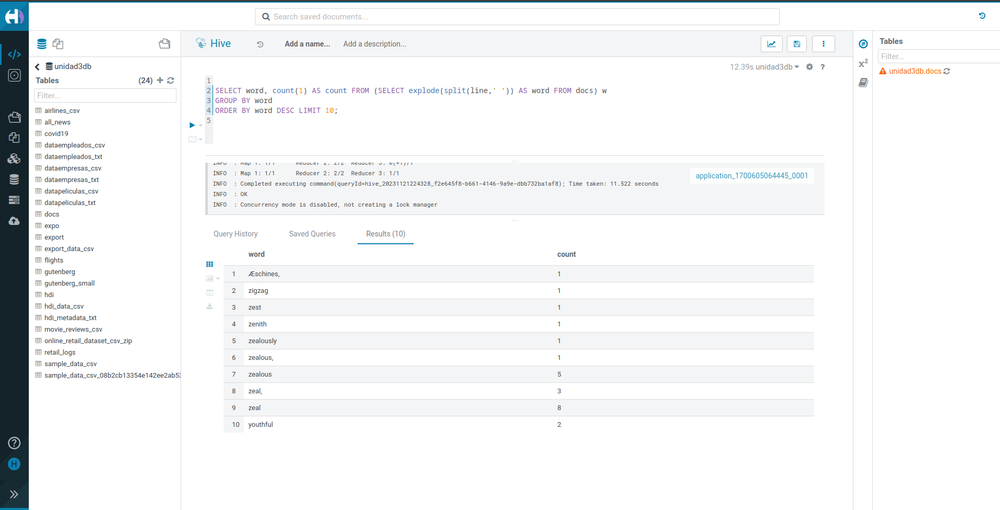
2.  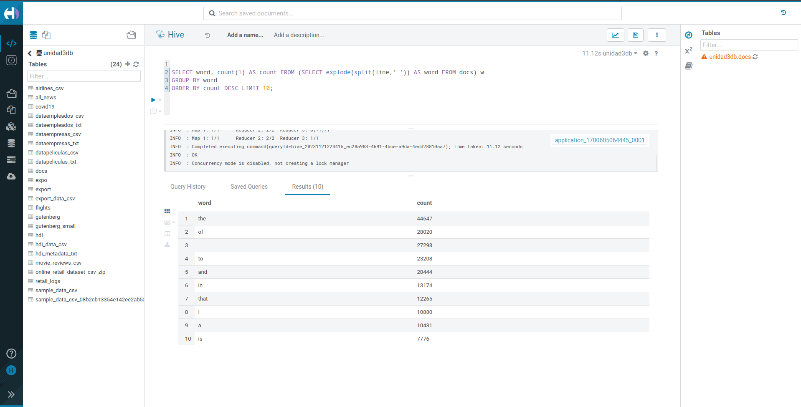

# Tercer paso: IMPLEMENTACIÓN DE UN DATA WAREHOUSE CON EMR y HIVE

   1. Crear redshift cluster
      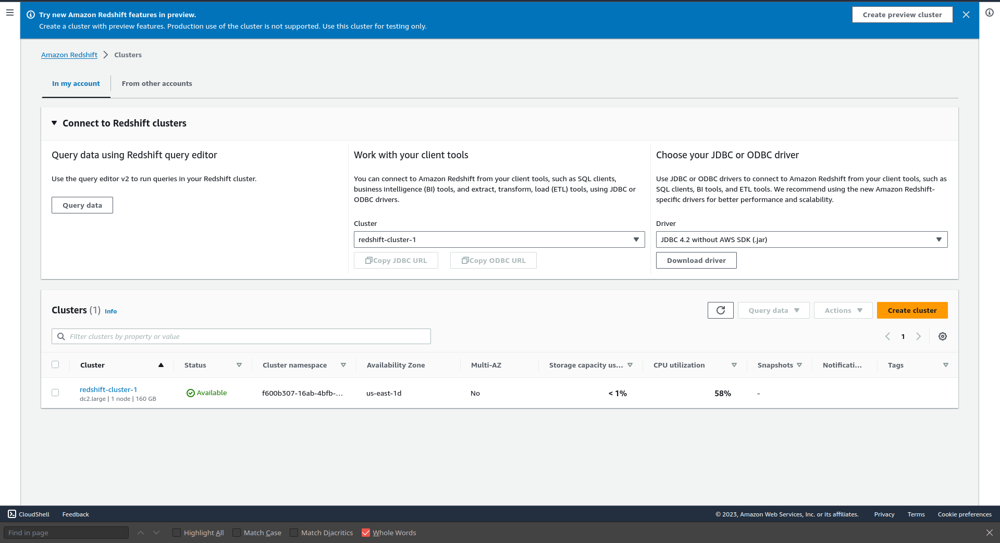
      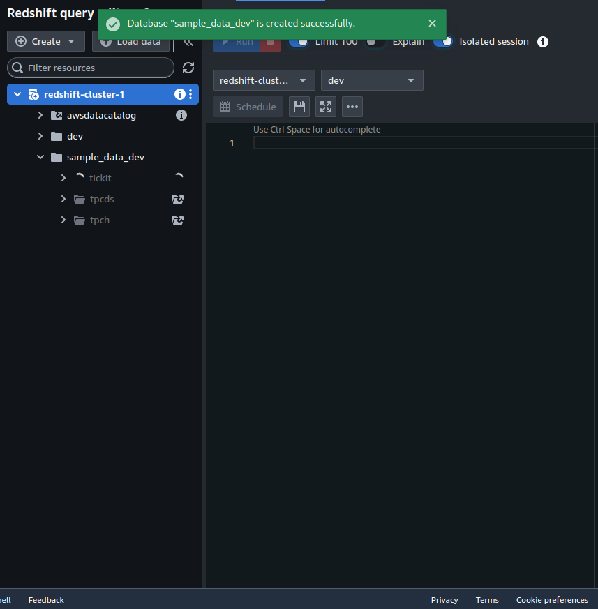
   2. Correr los querys de tickit
      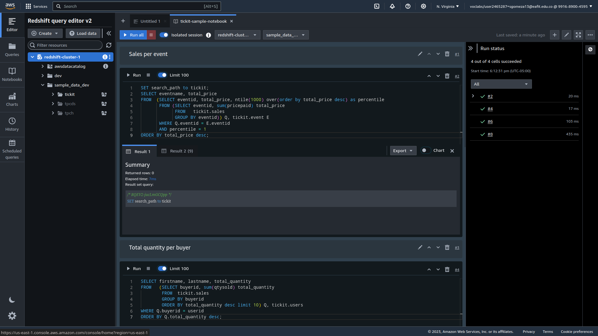
      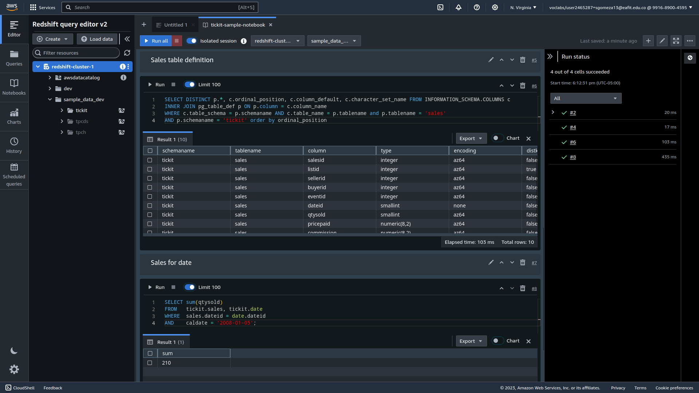
   3. Crear un rol IAM para Amazon Redshift
   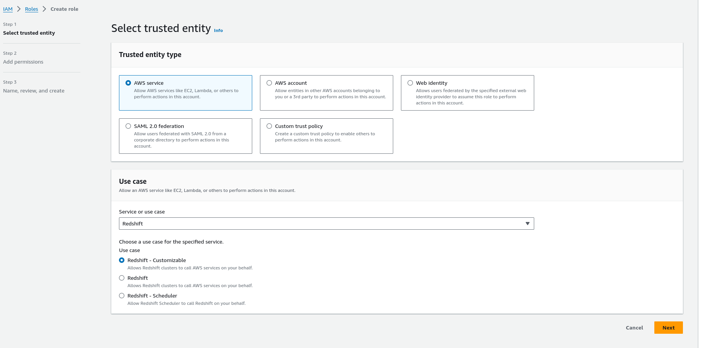
   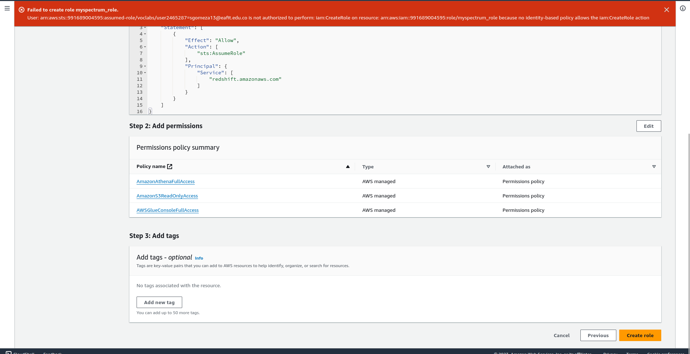
   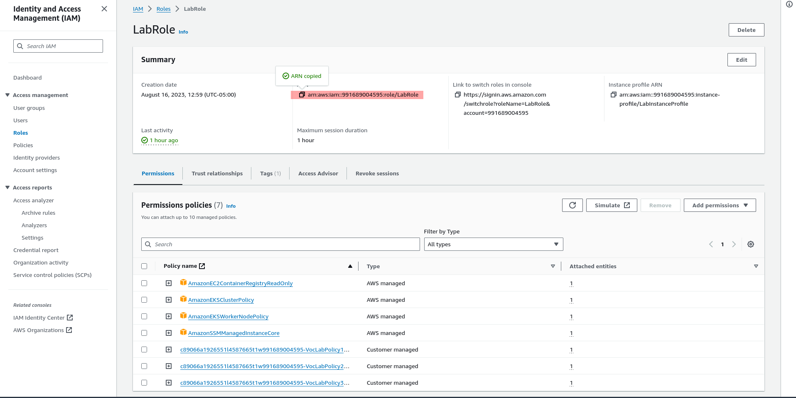
   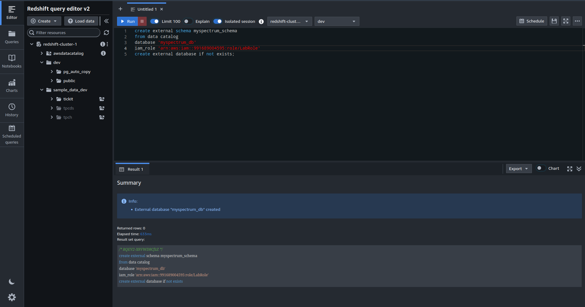
   4. Crear una base de datos externa en s3
   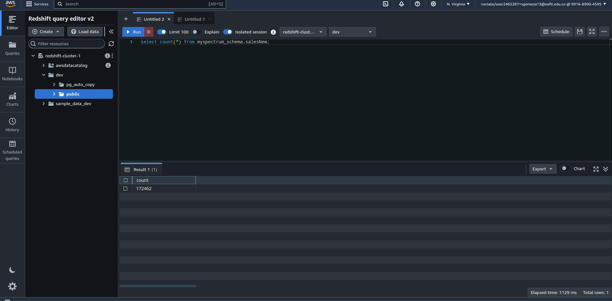
   5. Cargar datos en tabla event2
   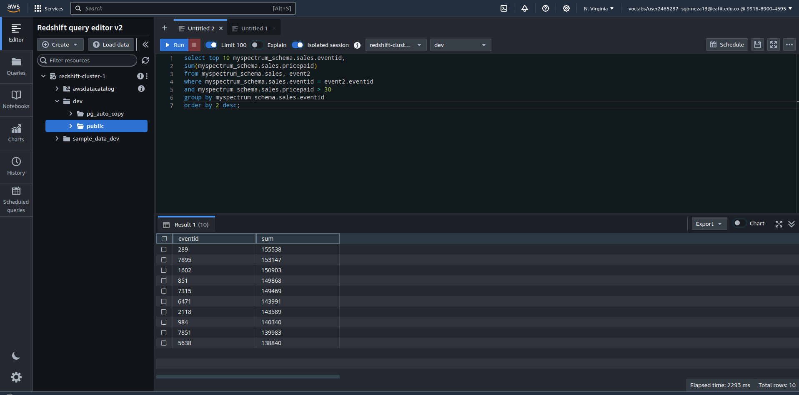
